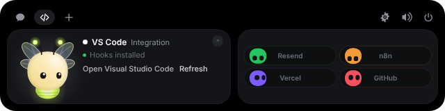
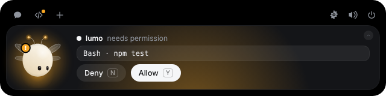
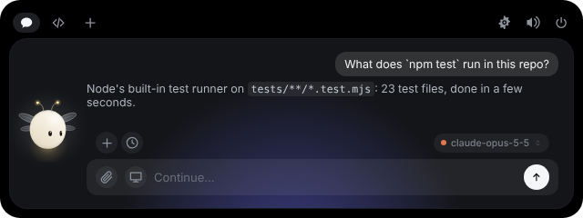
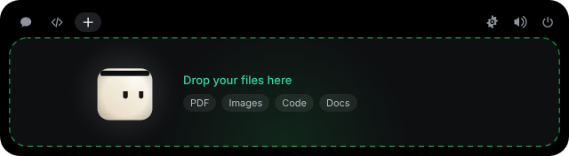
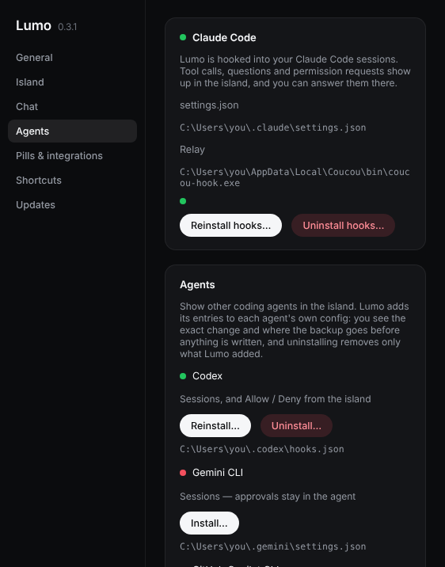

<div align="center">


# Lumo for Windows

**Lumo doesn't get a notch on a PC — so it lives at the top of your screen instead.**

Approve Claude Code permissions, watch your session work, drop a file, chat with Claude, keep an eye on your services — without leaving what you're doing.


</div>


---

## Install

Download **[Lumo-Windows.msi](https://github.com/Rccrd12/Lumo/releases/download/windows-latest/Lumo-Windows.msi)**
(Windows Installer) or **[Lumo-Windows-setup.exe](https://github.com/Rccrd12/Lumo/releases/download/windows-latest/Lumo-Windows-setup.exe)**,
always the newest version, and run it. The .exe installs for the current user only, with no admin prompt; the .msi may ask for admin rights.

**Windows will show a warning the first time — that's expected.** The installer isn't code-signed yet, so SmartScreen doesn't know the publisher:

1. A **"Windows protected your PC"** screen appears, with *Publisher: Unknown publisher*.
2. Click **More info** (*Informations complémentaires* in French). This reveals a **Run anyway** button.
3. Click **Run anyway** (*Exécuter quand même*). The installer starts normally.

This is only because the app isn't signed with a paid certificate yet. Lumo is open source, and Microsoft Defender scans the installer as clean.

Microsoft Defender once flagged the installer by mistake (`Trojan:Win32/Wacatac.H!ml`,
a machine-learning false positive); Microsoft reviewed it and removed the detection.
If Defender still blocks it on your PC, update its definitions (`Update-MpSignature`
in PowerShell) and try again.

You can also [build it yourself](#build-it-yourself).

### Updates

**Settings… → Updates** shows the version you run. **Check for updates** asks
GitHub for the newest `windows-v*` release of
[Rccrd12/Lumo](https://github.com/Rccrd12/Lumo/releases) — only
when you click it, never in the background. When there is a newer one, **Update
now** downloads its `Lumo-Windows-X.Y.Z-setup.exe` into a temporary folder,
starts it with its usual window, and Lumo quits so the installer can replace
it. Only installers from that repository's GitHub releases are accepted. On
Linux, update Lumo the way you installed it.

### Your data

Settings are in `%APPDATA%\com.rccrd12.lumo` (`~/.config/lumo` on Linux); the
relay, the inbox, the log, the weekly recap and the chat history in
`%LOCALAPPDATA%\com.rccrd12.lumo` (`~/.local/share/lumo`); keys in the system
keychain under `com.rccrd12.lumo`. Updating from 0.4.0 or earlier moves them
there at the first launch, keys and chat history included. Hooks you installed
before keep working; installing them again (Settings → Agents → Reinstall)
points them at the new folder, and once none uses the old one it goes. With
**Open at login** on, Lumo writes its autostart entry again at every launch for
the exe it runs from.

## Using it







| What you do | What happens |
|---|---|
| Move the mouse to the very top-centre of the screen | Lumo peeks out |
| Click the small island | It opens |
| Click Lumo | It gets annoyed for a moment |
| Rest the pointer on Lumo for two seconds | Hearts |
| Right-click Lumo | The wardrobe: rest the pointer on an outfit to try it on, click to keep it. **Auto** dresses him for the season (the scarf in winter, the leaf in spring). Next to the outfits, **Lumo's style** picks his look the same way: **Filo**, a ring of light whose colour tells what is going on (the default), **Punto**, a dot of light, **Goccia**, a soft drop, or **Lucciola**, the firefly; also in Settings → Island → Lumo's look |
| Drag a file onto the island | Lumo turns into a box, swallows it, then offers to answer questions about it |
| Click a file in the session ticker | Its diff opens in the island; ↗ opens the file in VS Code, ‹ or `Esc` goes back |
| Drag the island by its top bar (the closed island from anywhere, or `Alt` + drag anywhere) | Picks it up; let go and it docks on the nearest edge of the screen under the mouse: top, bottom, or upright on the left or right side, centred when dropped near the middle of the edge. **Put the island back in the centre** (tray menu or Settings) brings it home to the top |
| Power button at the top right of the open island | Quits Lumo (open it again from the Start menu) |
| Drag an edge or a corner of the open island | Resizes it (560–1200 px wide, up to 640 px tall); along the edge it hangs from, both sides move together so it stays in place. A double click on the grip puts the usual size back |
| In the open island: `Ctrl +` / `Ctrl −` / `Ctrl 0` | A bigger or smaller island, or the usual size (also **Settings… → Island → Island size**, 80–160 %, 115 % by default). **Icon size** (100–150 %, 125 % by default) sits next to it |
| `Esc` | Closes the island |
| Tray icon | Open, Weekly recap, Wardrobe…, Settings…, Pause, Quit |
| `Ctrl+Alt+Space` | Opens the chat, from any app |
| `Ctrl+Alt+P` | **Ask about my screen**: takes a screenshot of the screen under the mouse and opens the chat with it waiting as a chip (× takes it back). Type the question and press Enter; nothing is sent before that (Windows) |
| `Ctrl+Alt+L` | **Talk with Gemini Live**: opens the island on a spoken call with Gemini (see [Talk with Gemini](#talk-with-gemini-gemini-live)); pressed again while the call is on screen, ends it |
| `Ctrl+Alt+X` | **Ask about the selected text**: opens the chat with the text selected in the app in front, from a PDF, a web page or anything else. Lumo copies it for you and puts your clipboard back as it was; in terminals and code editors it copies with `Ctrl+Insert`, so a running command is never interrupted. On Linux it reads the selection with xclip, xsel or wl-paste |
| In the chat: the screen button → **Folder open in File Explorer** | Shares the folder of the File Explorer window you used last: its files and subfolders (names, sizes, dates) go with your next question, and a file of it you name ("read file.pdf") is attached as if picked with the paperclip (Windows) |
| `Ctrl+Alt+A` | Jumps to the waiting permission or question |
| `Ctrl+Alt+T` | Brings the session's window forward ("Open terminal") |
| `Ctrl+Alt+→` / `Ctrl+Alt+←` | Next / previous pill |
| `Ctrl+Alt+S` | Mutes or unmutes Lumo |
| `Ctrl+Alt+G` | Opens the wardrobe |
| `Ctrl+Alt+N` | Opens and closes the island (off until you turn it on) |
| In the open island: `Ctrl+→` `Ctrl+←`, `Ctrl+1`–`Ctrl+9` | Switch pills |
| In the open island: `Ctrl+Enter`, `Ctrl+K` | Send, start a new chat |
| In the open island: `Ctrl+,`, `Ctrl+P` | Settings, keep the island open |

### The closed island

Like a Dynamic Island, the closed island says what is going on next to Lumo,
and grows a little to say it (on the top and bottom edges; upright on a side
it stays as it is). One thing alone sits in the middle, as wide as it needs;
several sit side by side, each more compact (what the AI is doing, the next
event, up to two timers, the music). Their buttons work: resting the mouse on
them never opens the island, even with Open on hover.

- **What the AI is doing**: "Haiku · Reading main.ts", "Haiku · Writing…",
  "Gemini Live · Looking at the screen", "Claude Code · Waiting for your
  OK". Nothing at all while nothing is going on.
- **What just happened**, for a few seconds: "Haiku answered" when the chat
  answers while it isn't on screen, "Haiku answered" or "Claude Code
  answered" when Gemini Live's helper is done, a session on another pill
  that finished, a deploy or a workflow.
- **A new email** (the **Email** pill): the sender, the subject and the
  first lines, with **Summarize**, **Draft a reply** and **Open**. It stays
  while the mouse is on it. Summarize and Draft a reply open the chat with
  the email attached and ask; nothing is ever sent: you copy the draft and
  send it yourself.
- **Timers**: ask any model in the chat or Gemini Live ("set a 10 minute
  timer for the pasta"), type `/timer 10m pasta`, or start one in the live
  activities. The time left counts down; it rings and says so when it is
  over.
- **The next event**: "Stand-up · in 5 min", from the calendar in the live
  activities.
- **The music playing**, with previous, play/pause and next: Spotify, a
  browser, any player that shows in the system's media controls (Windows)
  or speaks MPRIS (Linux). Gemini Live can play, pause and skip too.

### Live activities

Beside the open island (on the top and bottom edges) a second island holds
what goes on and what can be started: **Timer** (the running ones, 1, 5, 10
or 25 minutes in one click, or type `15m pasta`), **Music** (what plays, with
previous, play/pause and next), **Calendar** (the next events) and **Email**
(the newest unread: a click on one opens it, with Summarize, Draft a reply and
the eye, which puts it away so the next one moves up). Its **–** (top right)
folds it, with a flight, into an icon right of the **+** in the island's top
bar; that icon brings it back. Settings → Island → **Live Activities** turns
it off.

On Windows it can be moved and resized like the island: drag its top bar and
it comes off the island into a window of its own, which stays wherever you
leave it (it shows while the island is open); drop it against the island's
left or right side and it joins it there. Its edges and bottom corners resize
it. On Linux it stays on the island's left.

The calendar is read from its **secret iCal address**, pasted in Settings →
Island → Calendar (Google Calendar: Settings → your calendar → Integrate
calendar → Secret address in iCal format; Outlook and iCloud publish one
too). It stays in the system keychain, and is fetched every 15 minutes, only
read.

Settings → Island → **Say what's going on** and **Show the music playing**
turn them off. While the island is hidden nothing is asked or counted: the
music is only asked about while the closed island is on screen.

### Keyboard shortcuts

Every global shortcut can be changed or turned off in **Settings… → Shortcuts**:
click it and press the new keys. A combination another app already holds is
flagged *In use*, and two Lumo shortcuts on the same keys are flagged *Used
twice*. While you record a new one, Lumo lets go of its own so the keys reach
the recorder.

The defaults are not the Mac's `⌃⌥` letters. On Windows, `Ctrl+Alt` is `AltGr`,
so a global `Ctrl+Alt+E` would swallow every `€` typed on a French or German
keyboard. The defaults were checked against the AltGr layer of the French,
German, Spanish, Italian, Portuguese and Brazilian (ABNT2) layouts — that is why
pill switching uses the arrows rather than `[` `]`, and mute is `S` rather than
`M` (`AltGr+M` is `µ` in German). On top of that, Lumo asks Windows what each
`Ctrl+Alt` combination types on the layouts you have installed and leaves any
that types a character unregistered, flagged *Types “ą”* in Settings: Polish,
for one, puts `ą` on `AltGr+A` and `ś` on `AltGr+S`. The recorder refuses such
a combination too.

Older Intel graphics drivers rotate the screen on `Ctrl+Alt+←` / `→`; if yours
still does, those two show up as *In use*.

Everything else happens on its own: a Claude Code permission request opens the
island with **Deny / Allow**, a question from Claude Code shows its options to
pick from, a finished session shows what it did, and
your integrations sit in the coloured pills next to Lumo.

A permission card or a question stays until you answer it: the mouse leaving
never folds it, it comes up even when the island is already open or another
pill is in front, and the pill you were on comes back once you answer. To keep
it for later, fold it with the **⌃** in its corner (or `Esc` in the island): the
island shrinks to its compact size and stays on screen, nothing is answered, and
opening it again shows the card. **Open terminal** brings the window the session
runs in to the front.

Lumo always stays in the island: he can't be dragged out onto the desktop
(earlier versions let him; one left there comes home).

**Live diff.** Every file Claude edits (Edit, MultiEdit, Write) shows up in the
session ticker with its **+N −M** lines; click it for the diff. Same limits as the
Mac: past 200 KB or 4 000 lines only the counts are kept, at most 50 diffs per
session, and they are forgotten an hour after the last edit or when the session
ends. When Claude finishes, the card keeps the first paragraph of its final
answer on one line, still, until the next prompt.

## Your pills

**Settings… → Pills & integrations** lists the tools you use, from the same catalog as
the Mac app. Pick your **main tool** — VS Code, Cursor, Codex or Antigravity —
which is always there and doesn't take a slot, then declare up to four more:
agents (Copilot CLI, Muse Code, OpenCode, Amp, Hermes, Claude
Desktop), the chat providers (Anthropic, Google AI, OpenAI, Ollama, LM Studio),
and the services under **Integrations**. A pill fed by hooks says whether its
hooks are installed, never asks for a key; a local model server's pill says
whether the chat is connected to it. A session on a pill you didn't
declare still shows up, for as long as it runs.

### Email

The **Email** pill (Settings… → Pills & integrations) reads your inbox over
IMAP: Gmail, Outlook, iCloud, Yahoo or any IMAP server, with an **app
password**. The connection stays open and the server says when an email
arrives (IMAP IDLE); Lumo also looks every 20 seconds in case the server is
slow to say, fetching only new emails. A server without IDLE is asked every
30 seconds. Its card lists the newest unread emails, and a new one
shows on the closed island (see [The closed island](#the-closed-island)).
Lumo only reads: the inbox is opened read only, emails stay unread, and
nothing is ever sent, moved or deleted. The address, the server and the app
password are in the system keychain.

For Gmail: turn on 2-Step Verification in your Google account, create an app
password at <https://myaccount.google.com/apppasswords>, and paste it in
Settings with your address; the server is found from the address. Your
Google account's own password is refused ("Application-specific password
required"). Claude
Code and Antigravity CLI see the email only when you press Summarize or
Draft a reply: it goes with that question, like a selected text.

## Claude Code



Open **Settings… → Agents → Claude Code → Install hooks…**. You get the exact diff of what
will change in `%USERPROFILE%\.claude\settings.json`, the path of the dated backup
that will be taken, and nothing is written until you click. Your own hooks are
never touched, and uninstalling removes only Lumo's entries.

The relay is a tiny executable, `lumo-hook.exe`, copied to
`%LOCALAPPDATA%\com.rccrd12.lumo\bin\` at launch. It is given 300 ms to reach Lumo and
exits cleanly if the app is closed, slow or crashed — **a Claude Code session is
never blocked or slowed down by Lumo.** If nobody answers a permission request
in time, Lumo stays quiet and Claude Code asks in the terminal as usual.

It works from any terminal — Windows Terminal, PowerShell, VS Code, Git Bash.

### Plan usage

As on the Mac, the island's header can show your plan limits: a small pill
("Claude 73%", green below 50 %, orange up to 80 %, red above) for the 5-hour and
weekly Claude limits, and another for Codex. Click one for the details and the
reset times. Both are off by default; turn them on in **Settings… → Agents → Plan usage**.

- **Claude** (Pro and Max plans): the numbers come from Claude Code's own status
  line. **Show in notch** first shows you the diff of the `statusLine` change in
  `%USERPROFILE%\.claude\settings.json`, takes a dated backup and writes only
  after your click, with the same writer as the hooks: the status line becomes `lumo-hook --statusline`, which
  passes only the limits on (300 ms at most) and runs the status line you had
  before — kept in `statusline-previous.json` next to the relay — with the same
  input, printing what it prints. On Windows that one runs through Git Bash, as
  Claude Code runs it (`CLAUDE_CODE_GIT_BASH_PATH`, then the Git for Windows that
  `git.exe` on `PATH` belongs to, then the usual install folders); it gets 10 s
  and 64 KB of output. **Uninstall relay** puts your status line back. The
  numbers arrive with Claude Code's replies.
- **Codex**: nothing is installed. When the pill shows (or is clicked, at most
  once a minute) Lumo starts `codex app-server` and asks it
  `account/rateLimits/read`, as Codex's `/status` does, then stops it (15 s at
  most, never while paused). Codex must be signed in with ChatGPT.

## Weekly recap

On Monday from 8 am, the first time Lumo starts, an agent starts working or
you wake the island, a card sums up the past week: time spent, sessions, files
and lines changed, commands run, permissions and questions, your top agent,
top project, busiest day and longest session. **Tray → Weekly recap** opens it
any day.

**Share image** turns it into a 1080 × 1920 picture with Lumo. **Save image**
writes it to your Pictures folder (Downloads if there is none) as
`Lumo weekly recap YYYY-MM-DD.png`, never over an existing file; **Copy** puts
it on the clipboard. **Hide project names** leaves the project out of the image.

The history is `recap.json` next to the log, a 12-week rolling window: counts,
the agent and the project folder's name — never a command, a file path, file
contents or a prompt. It never leaves your machine. **Settings → General →
Weekly recap** turns it off or clears it.

## Languages

Lumo speaks the same ten languages as the Mac app: English, 简体中文, हिन्दी,
Español, العربية, Français, বাংলা, Português (Brasil), Русский and Bahasa
Indonesia. **Settings… → General → Language** picks one; **System** (the
default) follows your system's language when it is one of these, English
otherwise. The island, the settings window and the tray menu switch at once —
nothing restarts, and the island keeps its sessions, steps and chat.

In Arabic the island's cards read right to left; Lumo, the pills and the
header stay where they are, and commands, code and file paths stay left to
right. Steps already in a session's ticker keep the language they were written
in, as on the Mac.

The translations are the Mac's own (`i18n-source/Localizable.xcstrings`,
turned into `src/i18n/strings.json` by `node scripts/gen-strings.mjs`), plus
`src/i18n/extra.json` for what only Windows and Linux show. Both are keyed by
the English text; a string missing in a language shows in English. The Rust
side (tray, errors) embeds the same two files.

## Chat and keys

**Settings… → Chat → Claude** takes your Anthropic API key. Keys live in the **Windows
Credential Manager**, never on disk and never in the interface — the island can
only ask whether a key exists. Same for every integration key.

The chat also talks to **Google AI (Gemini)**, **OpenAI** and **OpenRouter**:
add their keys in **Settings… → Chat → Chat providers**, then click the model name
above the chat box to switch provider and model, as on the Mac. The model list
is fetched from the provider only once you pick it and it has a key. Switching
mid-conversation carries the conversation over as plain text, so nothing in one
provider's format is ever sent to another. These providers get no web search
and no tools — they answer, they never act on your PC.

**Local models**: **Settings… → Chat → Local models** connects **Ollama** or **LM
Studio** (leave the address empty for the usual one on this PC; Ollama's
`OLLAMA_HOST` is honoured) or any server that speaks the OpenAI API (vLLM,
llama.cpp…), with an optional key kept in the credential store. Answers stream
in as they are written, and the `<think>` blocks of reasoning models stay
hidden. A text file you dropped goes along inline (24 000 characters at most);
images and PDFs by name only. Settings tells you whether the address is this
PC — nothing leaves it then — and warns before a key would travel over plain
`http://` to another machine.

Answers from every provider are shown as **Markdown**: headings, lists, bold,
inline code, quotes, and code blocks with a copy button. It is built from text
nodes, never parsed as HTML, and only `http`/`https` links open. Lumo greets
you by your first name when your account has one (the Windows display name or
the Linux GECOS full name; a bare login name is not used).

To send the Claude chat through an Anthropic-compatible gateway, set
`LUMO_ANTHROPIC_BASE_URL` (for example `https://gateway.example.com`;
`/v1/messages` is added). It must be `https://`, or `http://` to this PC only.
Claude Code's own `ANTHROPIC_BASE_URL` is deliberately ignored: your key only
goes where you told Lumo to send it. The gateway's host is written to the log
once; the key never is.

No telemetry. The only network requests Lumo makes are to the services you
configure yourself.

### Chat with your Claude plan (Claude Code)

Pick **Claude Code** above the chat box and the island talks to the Claude Code
CLI you already use, signed in with your own Claude plan (Pro, Max…): no API key.
Lumo runs the unmodified `claude` binary as `claude -p`, in `%USERPROFILE%\Lumo`
(`~/Lumo` on Linux); it never reads, stores or forwards any Claude credential,
and the usage counts against your plan's limits like any Claude Code session.

Unlike the other providers, Claude Code can act: it reads a dropped PDF or image
from its path, reads and edits files and folders, runs commands and searches the
web. Every action that needs a permission comes up in the island as the usual
**Deny / Allow** card, through the hooks of **Settings… → Agents → Claude Code**. Without
those hooks, or if nobody clicks, Claude Code denies the action: nothing is ever
allowed on its own. The conversation continues the same Claude Code session
until **New chat**. Install Claude Code and run `claude` once in a terminal to
sign in before using it. Its **Effort** is a slider under the models, from
Faster to Smarter (low, medium, high, extra high, max), with **Auto** beside it
for the level its model is made for; it goes to Claude Code as `--effort`.
Claude Code's own run never shows up as a session in the island: only its
permission requests do, as a card over the chat.

**The shield** next to the screen button (Claude Code and Antigravity CLI only)
says what the CLI may do without a card, from the next message on: **Ask every
time** (the default), **Auto** (the AI decides what is safe to do without
asking, and asks for the rest: Claude Code's own auto mode) or **Plan only**
(it reads and plans, and changes nothing). It
lights up while it may do more than ask. There is no mode that lets every
action through: Lumo never passes `bypassPermissions` or
`--dangerously-skip-permissions`.

### Chat with your Google account (Antigravity CLI)

Pick **Antigravity CLI** above the chat box and the island talks to the
Antigravity CLI (`agy`), signed in with your own Google account: no API key.
Lumo runs the unmodified `agy` in headless mode (prompt on stdin as
stream-json), in the same folder as Claude Code; it never reads, stores or
forwards any Google credential. Install it with
`irm https://antigravity.google/cli/install.ps1 | iex` in PowerShell
(`curl -fsSL https://antigravity.google/cli/install.sh | bash` on Linux) and run
`agy` once in a terminal to sign in. Lumo looks for it on `PATH`, then in
`%LOCALAPPDATA%\agy\bin` (`~/.local/bin` on Linux).

Like Claude Code, it reads the files you drop or attach and the folder you
share, says what it is doing next to the typing dots, stops on **Stop**, and
continues the same conversation (`--conversation`) until **New chat**. Its
models come from `agy models` (**Default** leaves agy's own choice), in the
picker and in **Settings… → Chat → Antigravity CLI**. There is no effort to
pick: each model carries its own in its name (`gemini-3.8-flash-low`), and agy
refuses a mismatched `--effort`. The shield's **Plan only** goes to agy as
`--mode plan`; **Auto** leaves agy to its own judgement, as it does without a mode. Headless agy never prompts: it reads and writes workspace files
freely, and a shell command needs your approval. With the hooks of
**Settings… → Agents → Antigravity** installed, each one is a **Deny / Allow**
card over the chat (reinstall the hooks if they predate this version, or the
card only waits 8 seconds); without them, or if nobody clicks, the command does
not run and the answer says so. Lumo never passes
`--dangerously-skip-permissions`. Google replaced Gemini CLI with Antigravity
CLI, so Settings no longer offers Gemini CLI: its pill is gone, and
**Settings… → Agents** only lists its hooks when they were installed before,
so they can be removed.

Next to the model name, **+** starts a new chat and the clock lists your past
chats, to reopen (a Claude Code chat continues its session) or delete; they are
kept on this computer only, 40 at most. The paperclip in the text field opens
the file picker: with Claude Code the file joins the conversation, with the
other providers it starts a new chat, as a drop does. `Ctrl+V` in the text
field does the same with what you copied: a screenshot (`Win+Shift+S`) or
another image is saved in the inbox (up to 32 MB), and a file copied in File
Explorer is copied there like a dropped one (the first, when you copied
several). Text pastes as usual.

### Show the chat your screen

The screen button next to the paperclip lets the assistant see what you have
open, only when you ask. Its menu offers **Open windows** (the titles and app
names of your visible windows, the one you were in marked as active), one
**Screen 1**, **Screen 2**… entry per display, and **All screens** when there
are several. Nothing is listed or captured until you click an entry, and never
in the background. A screenshot (one PNG per display, scaled down to 1568 px on
its long edge) shows first with **Send** and **Cancel**: Cancel deletes it, Send
adds it to the chat, with the question already typed if there is one. The window
list shows as a chip you can remove before sending. Either goes with your next
question only. Screenshots are saved only in the inbox
(`%LOCALAPPDATA%\com.rccrd12.lumo\inbox`), like dropped files, and are deleted after a
week. The island keeps itself out of the screenshot (Windows 10 2004 and later).

Claude Code reads the screenshots from their path; Anthropic, Google AI, OpenAI
and OpenRouter receive them as images; the local model servers take the window
list only. Claude Code is told to ask you to press the screen button when it
needs to see something, never to capture the screen itself. On Linux the button
says it isn't available yet.

**Folder open in File Explorer**, at the bottom of the same menu, shows the name
of the folder in the File Explorer window you used last (the tab in front, on
Windows 11); it is greyed out when that window shows no folder on disk (This PC,
Quick access, a library). Opening the menu only reads that name. Clicking the
entry lists the folder — names, sizes and dates of its files and subfolders, up
to 300, never their contents — and adds it as a chip you can remove. With your
next question, a file of that folder you name, with or without its extension
(*mi leggi il file 'file.pdf'?*), is copied into the inbox and attached exactly
as if you had picked it with the paperclip, one per question and up to 32 MB.
Claude Code is also given the folder itself, for the rest of that chat, so it
can open its other files, each with its usual permission card. Folders whose
path has characters such as `&` or `%` are left out of that, and Claude Code
asks before reading there. Not available on Linux yet.

**Settings… → Chat → Always share the folder open in File Explorer** (off by
default) does this for every message: while you type, the folder's name shows
as a chip, and when you send, its path and listing go with the message, as if
you had picked the entry each time. The chip's × leaves it out of that one
message. Lumo asks File Explorer only when the text field takes focus and when
you send, never in the background. With it off, the chat sees no folder unless
you pick it from the menu; Claude Code says so, and points you to the button and
to this setting.

### Talk with Gemini (Gemini Live)

The microphone button at the end of the chat box, or `Ctrl+Alt+L` from any
app, starts a spoken call with **Gemini 3.8 Live**, or **Gemini 3.8 Live
Extended Thinking**, which reasons in the background while it talks (pick it
and its thinking level in **Settings… → Voice**, with one of Google's 30
voices). It uses the Google AI key of Settings, from
[aistudio.google.com](https://aistudio.google.com): Google bills each call
by the minute.

Talk as you would to someone at your desk; you can speak over Gemini, and
it stops. What both of you say is written in the island as you go, there is
a field to type to it, a button that turns the microphone off, and the red
button ends the call. The call goes on when the island closes: the compact
island stays on screen and Lumo shows it, blue while Gemini speaks, violet
while it thinks, indigo while it works on something. It ends on its own
after 5 minutes with nobody speaking, or when you say goodbye, and is kept
in the chat's past chats.

Gemini uses the computer by itself, when it decides it needs to:

- **It looks at the screen** (Windows): a screenshot of every display,
  made smaller and sent to Google; the file is deleted at once, nothing is
  kept. Turn **Gemini can look at the screen** off in Settings → Voice and
  it can't.
- **It sees the open windows** and **the folder open in File Explorer**.
- **It finds files by name** in your home, Desktop, Documents, Downloads,
  Pictures, Music and Videos folders (OneDrive's too) and the folder open in
  File Explorer, **reads** text files, images and folders, and **reads PDFs**
  and Office documents through Gemini Flash.
- **It opens** documents, folders and web pages, and **starts apps** by
  their name, from the Start menu (or the Linux app menu). It never runs a
  program or a script by its file.
- **It types in the text box you clicked in**, in any app, when you ask it
  to write something there. It never presses Enter and never sends: a line
  break is Shift+Enter (a new line in a message or an email), and in a
  terminal line breaks are typed as spaces, so nothing runs. Nothing is
  typed into Lumo itself, or while a key like Ctrl is held, and it stops if
  you move to another window. On Linux it needs `xdotool` (X11) or `wtype`
  (Wayland).
- **Anything else goes to Claude Code or Antigravity CLI** (Settings →
  Voice → Helper, with the helper's model and, for Claude Code, its
  effort), which works on the task in its own session and reports back;
  Gemini tells you what it found or did. That includes the apps and
  accounts you connected to the helper, such as your calendar or email:
  "add this to my calendar" goes to Claude Code with its connectors. What
  the helper may do without asking follows the chat's permissions (the
  shield); anything else comes up as an Allow / Deny card in the island,
  over the call.

The Google AI key stays in the system keychain: Rust asks Google for a
short-lived token that opens one connection, and the island connects with
that. Google ends a connection every ten minutes or so; the call moves to a
new one between sentences, and carries on where it was.

The microphone is only asked for when a call starts. On Windows, the
microphone must be allowed for desktop apps in **Settings → Privacy &
security → Microphone**.

## GitHub

With a token in **Settings… → Pills & integrations → GitHub** — a classic token with
the `repo` scope, or a fine-grained one with read access to Pull requests,
Commit statuses and Actions — the GitHub pill shows:

- **My PRs**: your open pull requests and their CI status.
- **To review**: the pull requests waiting for your review.
- **Default branch CI**: the CI of the default branch of your 10 most recently
  pushed repositories.
- Your stars and the **last 7 days of contributions** in the card header; click
  them for the past 23 weeks, and hover or click a day for its count.

Click a row for the list, then an item to open it on github.com. The pill gets
a badge and a sound when the CI of one of your pull requests turns red or green
(fast runs between two checks included), when a default branch breaks, or when
someone requests your review. Pull requests are checked every 5 minutes, every
minute while a CI is running, and as soon as you open the card on data older
than a minute; contributions every 30 minutes. Nothing is fetched while the pill
is off or Lumo is paused.

## Build it yourself

You need [Rust](https://rustup.rs), [Node 20+](https://nodejs.org), and the
**MSVC build tools** (Visual Studio Build Tools with "Desktop development with
C++"). WebView2 ships with Windows 10/11.

```powershell
git clone https://github.com/Rccrd12/Lumo.git
cd Lumo/windows
npm install
npm run tauri dev      # live-reloading development build
npm run pack           # builds the installer and drops it in windows/release/
```

`npm run dev` alone serves the front end in an ordinary browser, which is enough
to work on the island's looks. It also serves `dev/upload-preview.html`, which
replays the whole file-drop choreography on a loop — the one part of the UI that
otherwise needs a real drag from Explorer to see — and `dev/recap-preview.html`,
the weekly recap card and its shared image on a sample week. None of these pages
ships in the app.

`npm run pack` leaves the files in `windows/release/`, the same names the release
workflow publishes:

```
Lumo-Windows-X.Y.Z-setup.exe      the versioned installer
Lumo-Windows-setup.exe            the same file under the rolling name
```

(and the .msi as `Lumo-Windows-X.Y.Z.msi` and `Lumo-Windows.msi`).

Installing is optional — `target/release/lumo.exe` runs on its own (`tauri build`
names it through `mainBinaryName` in `src-tauri/tauri.windows.conf.json`; on Linux
the binary is `lumo`). There is no
window in the taskbar and no console: the island at the top of the screen and the
Lumo in the notification area are the whole app, and Quit lives in its menu.

The 29 sounds live in `assets/sounds/`. They are synthesised from code by
`scripts/gen-sounds.mjs` (`npm run sounds` rewrites them, byte for byte the
same). The path is declared once, in `SOUNDS_DIR` at the top of
`vite.config.ts`, which serves them in development and copies them into
`dist/sounds` on build.

The app icon and the tray icon are drawn in code, like Lumo itself:

```powershell
npm run icons          # regenerates src-tauri/icons from scripts/gen-icons.mjs
```

### Layout

```
windows/
  src/                 island front end (TypeScript, no framework)
    mochi/             Lumo and the launch greeting, in Canvas 2D
    desktop/           Lumo's own little window on the desktop (switched off)
    island/            state machine, hooks, integrations
    views/             every island view
    settings/          the settings window
  src-tauri/           Rust backend: window, named pipe, Claude API, pollers
  hook/                lumo-hook.exe, the Claude Code relay
  scripts/             icon generator
```

### Log

`%LOCALAPPDATA%\com.rccrd12.lumo\lumo.log` — hook events, permission decisions, poller
problems. It stays on your machine. The weekly recap's history sits beside it in
`recap.json`.

## Supported agents

Every agent below is installed from **Settings → Agents** with the same steps as
Claude Code: the exact diff, the path of the dated backup, nothing written until
you click, and uninstalling removes only Lumo's entries. A config Lumo cannot
read, or where it finds something it does not expect, is left alone and the
reason is shown. Each agent gets its own pill (`agent_<name>`, the Mac's ids and
colours). The files are the Mac's, under `%USERPROFILE%` on Windows and `~` on
Linux.

| Agent | Installs | Permissions |
|---|---|---|
| Claude Code | `.claude\settings.json` (**Settings → Agents → Claude Code**) | Allow / Deny and questions in the island |
| Codex | `.codex\hooks.json` — then trust the hooks once with `/hooks` in Codex | Allow / Deny in the island |
| GitHub Copilot CLI | `.copilot\hooks\lumo.json` | Allow / Deny in the island |
| Muse Code | `.config\muse\settings.json` | Allow / Deny in the island |
| Gemini CLI (retired) | `.gemini\settings.json` — listed in Settings only when installed before, to remove it | asked in Gemini CLI |
| Antigravity and Antigravity CLI | `.gemini\config\hooks.json` (a `lumo` hook group) | asked in Antigravity |
| Cursor Agent | `.cursor\hooks.json` — Claude Code in Cursor's terminal also goes on the Cursor pill, through the Claude Code hooks | asked in Cursor |
| Claude Desktop (Windows) | nothing to install: Claude Code sessions from the Claude app are tagged by the relay | asked in the Claude app |
| OpenCode | plugin `.config\opencode\plugins\lumo.js` | asked in OpenCode |
| Amp | plugin `.config\amp\plugins\lumo.ts` | asked in Amp |
| Hermes Agent | plugin `.hermes\plugins\lumo\` — then `hermes plugins enable lumo` once | asked in Hermes |
| Any other | run `lumo-hook --agent <name> [<Event>]` from your tool's hooks | asked in the tool |

The relay maps every agent's event and field names onto Claude Code's (Gemini
CLI's `BeforeTool`, Copilot's `preToolUse`, Cursor's `beforeSubmitPrompt`…), and
answers each agent the way it expects. It never lets anything through on its
own: with no click it prints no decision at all (`{}` for the agents that need
JSON, `"ask"` for Copilot, which is fail-closed), so the agent asks in its own
terminal exactly as without Lumo — including when Lumo is closed.

The plugins start the relay directly, with no shell in between, and never wait
for it. Amp's steps appear as each tool finishes: its "before" hook must return
a verdict, and Lumo never gives one.

**How each agent runs the relay on Windows.** Hook commands are written for the
shell that runs them: Git Bash for Claude Code (quoted, forward slashes),
PowerShell for Gemini CLI and Copilot CLI (`& '…\lumo-hook.exe'`), `cmd /C`
for Codex. Cursor, Antigravity and Muse Code do not document theirs: the relay
path is written bare when it has no space or special character — which works in
cmd, PowerShell and when started directly — and in double quotes otherwise.
These three are untested on Windows.

A pill is **connected** when Lumo finds its own entries in the files above —
the same check as Settings → Agents (for Claude Code: a SessionStart hook
running Lumo's relay; the Cursor pill also counts Claude Code's hooks).
Lumo only reads these files, each time the island opens. Permission requests
get the island's card for Claude Code (in any terminal, and in Cursor's),
Codex, Copilot CLI and Muse Code; other agents and Claude Desktop ask in their
own window.

## What's different from the Mac version

- No notch, so the island lives at the top centre of the screen and retracts into
  the top edge instead of hiding in a notch.
- The closed island says what is going on (the AI at work, notes, a new
  email, timers, the music playing), and the **Email** pill reads an inbox
  over IMAP: neither is in the Mac app.
- Permission approval works from **any** terminal; the Mac build only listens to
  VS Code sessions.
- "Open terminal" finds the session's window by walking up from the relay's
  process to the terminal or editor that runs it. A session in a classic
  console window (`cmd.exe` or PowerShell without Windows Terminal) has no such
  ancestor — conhost owns that window — so its folder opens in VS Code instead,
  as it does when `code` is on your `PATH` and nothing was found.
- No global keyboard shortcuts yet: a waiting card is folded with its **⌃** or
  `Esc` in the island, and reopened by clicking the island or Open in the tray.
- Apple Music, the one pill from the Mac catalog with nothing behind it here,
  is left out.
- Not in this version: sending a dropped file by email and dragging Lumo onto
  a window to attach it as context. On the Mac, email goes through Resend or
  Apple Mail's scripting; neither has a safe equivalent that attaches a file
  here, and the drop card would need a third button it doesn't have.
- Cal.com shows the next bookings as a list rather than the Mac's calendar.
- The Cursor pill carries both Cursor Agent's own hooks and Claude Code running
  in Cursor's terminal.
- Hermes: Lumo writes the plugin but does not run the `hermes` CLI, so it is
  turned on once by hand. Hermes runs natively on Linux; on Windows it is
  untested.
- Plan usage: the user's previous status line runs through Git Bash on Windows
  (`/bin/sh` on Linux and Mac); without Git Bash it is not run, rather than
  guessed at with `cmd`. The Codex CLI is looked for on `PATH` and in npm's,
  Volta's, Bun's and pnpm's folders (and nvm's on Linux).
- The chat's model picker opens inside the chat card instead of a popover, and
  it also offers OpenRouter and any OpenAI-compatible server, which the Mac
  does not. Google AI, OpenAI and OpenRouter can see an image you dropped (sent
  inline), where the Mac sends its name only.
- Live diff: the relay forwards an edit's text whole only once the edit is done
  (PostToolUse), up to 256 KB per string and 512 KB per event. A bigger edit
  shows its "Edits · file" step without counts rather than wrong ones. The
  diff's ↗ needs `code` on your `PATH`; without it, it opens the file's folder —
  never the file itself. Counts and diffs come from Claude Code's Edit,
  MultiEdit and Write, on whichever pill its session is on (VS Code, Cursor,
  Claude Desktop); other agents' edits show as plain steps.
- The GitHub lists are clicked, not walked with the arrow keys, and there is no
  iPhone to keep fetching them while the pill is off.
- Keyboard shortcuts use `Ctrl+Alt` where the Mac uses `⌃⌥`, with different
  keys (see [Keyboard shortcuts](#keyboard-shortcuts)), and `Ctrl` where the
  Mac uses `⌘` inside the island. "Bring the terminal forward" is "Open
  terminal" here. Not in this version: sending Lumo to the desktop (he stays
  in the island) and attaching the front window (their ids are kept for later), moving through a card's
  list (`⌘↑` `⌘↓` `⌘O`) and the diff (`⌘E`). The island only reads its own
  shortcuts while it has the keyboard: in the chat, or after a global shortcut
  opened it. **Go to alert** brings up any agent's waiting card on its own pill;
  **Toggle the island** folds a waiting card rather than dropping it, like `Esc`
  in the island.
- Weekly recap:
  - Sharing happens inside the island instead of a separate panel, and Save
    writes straight into Pictures (or Downloads) instead of asking where. There
    is no system Share sheet; Copy uses the web clipboard.
  - Questions are counted when an agent asks one (`AskUserQuestion`), whether
    it is then answered in the island or in the terminal. Permissions count the
    Allow and Deny clicks on the island's card, for every agent that gets one.
  - There is no sleep/wake notification to listen to without a background
    loop, so after the machine wakes the Monday card waits for the first agent
    to start or for you to hover the island.
  - The card is 24 px taller than the Mac's: it also lists top agent, project,
    busiest day, longest session, permissions and questions, which the Mac
    leaves to the image. A turn cut short by the session ending still counts.
  - Tray → Pause doesn't stop the history (it stays on the machine anyway);
    switch it off in Settings → General.
- The wardrobe opens with a right-click on Lumo, from the tray menu, or with
  its global shortcut (`Ctrl+Alt+G` by default). In the compact island a tall hat
  is cut by the top edge of the screen, as it is by the notch on a Mac.
- Languages: chosen in Settings, independently of the system, and applied
  without a restart. Arabic turns
  the island's text right to left but not its layout: Lumo and the pills keep
  their sides.
- Lumo doesn't go out onto the desktop: he stays in the island, and the Mac's
  ⌃⌥D shortcut isn't there.

## Linux

The same app builds for Linux: everything that differs lives in
`src-tauri/src/platform/`, and the relay's transport in `hook/src/unix.rs`.

```bash
sudo apt install build-essential pkg-config \
  libwebkit2gtk-4.1-dev libgtk-layer-shell-dev libayatana-appindicator3-dev \
  librsvg2-dev libssl-dev libdbus-1-dev patchelf \
  gstreamer1.0-plugins-base gstreamer1.0-plugins-good
npm install
npm run tauri dev      # live-reloading development build
npm run pack           # AppImage, .deb and .rpm in windows/release/
```

On Arch Linux, install `webkit2gtk-4.1`, `gtk-layer-shell` and
`libayatana-appindicator` and build the same way; store API keys with GNOME
Keyring or KWallet.

What changes on Linux:

- **The island** is a gtk-layer-shell overlay anchored to the top edge, over any
  top panel, on compositors that support it: COSMIC, KDE Plasma, Hyprland, Sway
  and other wlroots compositors. GNOME has no layer-shell and ignores where a
  Wayland window asks to go, so there Lumo runs through XWayland as a dock
  window: top centre, on every workspace, still there after Super+D.
  `LUMO_X11=0` keeps the native Wayland window, `LUMO_DOCK=0` makes it a
  utility window instead of a dock. `LUMO_LAYER_SHELL=0` forces the regular
  window anywhere.
- **Click-through** is the window's input region, kept equal to the island
  shape, so the compositor sends every other click to what is underneath.
- **Moving, docking and resizing the island** (dragging its top bar, its
  grips) follow the cursor across the screen, which Linux does not give
  Lumo: the island stays at the top centre at its usual size there. Zoom and
  icon size work.
- **Lumo's eyes** follow the pointer only while it is over the island: Wayland
  gives no app the cursor position anywhere else.
- **Claude Code hooks** go through `~/.local/share/lumo/bin/lumo-hook` and a
  Unix socket at `$XDG_RUNTIME_DIR/lumo.sock`. Both ends check that the other
  runs as the same user. Every other agent uses the same relay, single-quoted
  for `sh`, and its config under `~` (see Supported agents). A config that is a
  symlink (dotfiles) is written through to its target, with its permissions
  kept.
- **Global shortcuts** are X11 key grabs, so they work in an X11 session.
  On X11, AltGr is a modifier of its own and never clashes with `Ctrl+Alt`;
  combinations the desktop already uses (GNOME's `Ctrl+Alt+T` terminal and
  `Ctrl+Alt+←`/`→` workspace switching) show up as *In use*. Wayland has no
  key grabs — the GlobalShortcuts portal isn't supported yet — so nothing is
  registered there, and **Settings → Shortcuts** lists commands to bind in your
  desktop's own keyboard settings instead:
  `lumo --shortcut openChat` (or the AppImage's path) runs the action in the
  Lumo that is already open. The ids are `toggleIsland`, `openChat`,
  `goToAlert`, `jumpToTerminal`, `nextPill`, `prevPill`, `muteToggle` and
  `wardrobeToggle`.
- **Keys** live in the Secret Service (GNOME Keyring, KWallet).
- **Plan usage**: the status line relay is `~/.local/share/lumo/bin/lumo-hook
  --statusline` and runs your previous status line with `/bin/sh -c`, like Claude
  Code. Codex is found on `$PATH`, in `~/.local/bin`, npm's global prefix, Volta,
  Bun, pnpm, or nvm (newest Node first), since a desktop launch often has a
  shorter `$PATH` than your shell.
- **Lumo's greeting** uses the full name in your account's GECOS field
  (`chfn` sets it); without one the chat stays neutral.
- **The chat's screen button** (open windows, screenshots) isn't available yet:
  its menu says so, and nothing is listed or captured. For the same reason
  Gemini Live can't look at the screen there; everything else
  in a call works. Typing in the text box you clicked in needs `xdotool` on
  X11 or `wtype` on Wayland, where line breaks are typed as spaces (Wayland
  doesn't say which window is in front).
- **Files**: preferences in `~/.config/lumo/`, the log at
  `~/.local/share/lumo/lumo.log`, the weekly recap history beside it in
  `recap.json`. A saved recap image goes to the pictures folder named in
  `~/.config/user-dirs.dirs`, else `~/Pictures`, else `~/Downloads`.
- **Languages**: Hindi, Bengali, Chinese and Arabic need fonts that carry those
  scripts; Lumo asks for the Noto families (`fonts-noto-core` and
  `fonts-noto-cjk` on Debian and Ubuntu, `noto-fonts` and `noto-fonts-cjk` on
  Arch). **System** reads the language from the webview, which follows
  `LANGUAGE` / `LANG`.
- **Copying the recap image** needs a WebKitGTK with image clipboard support;
  where it is missing, the island says so and Save still works.
- What the Windows build leaves out, this one does too: sending a file by
  email and dragging Lumo onto a window.
- **Open terminal** opens the folder in VS Code: Wayland lets no app bring
  another app's window forward, and X11 would need a window-manager client this
  build doesn't carry.
- No **Claude Desktop** pill: the Claude app has no Linux build.
